# Архитектурные диаграммы SEMD Bot (Mermaid)

## 1. Диаграмма компонентов и их взаимодействия

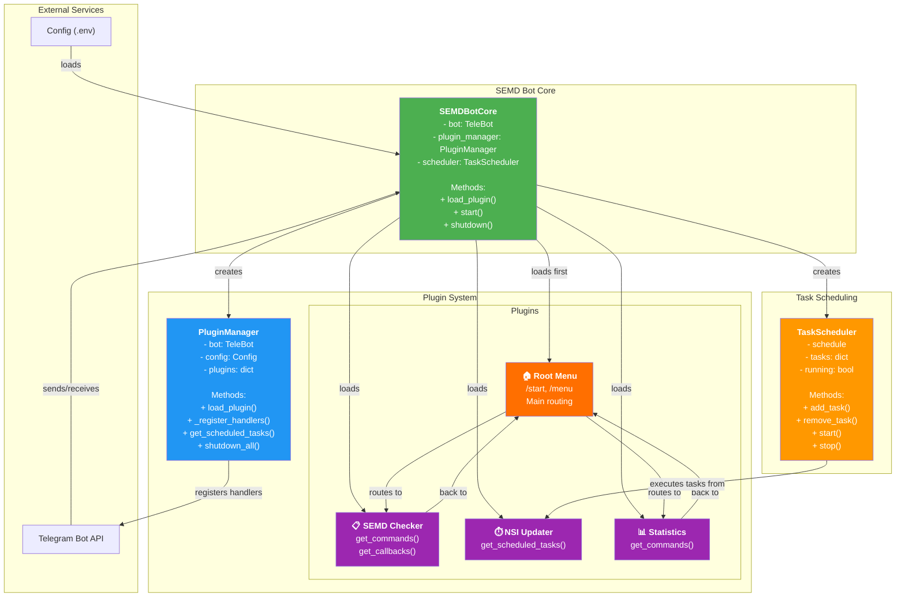
```mermaid
graph TB
    subgraph Core["SEMD Bot Core"]
        SEMDBot["<b>SEMDBotCore</b><br/>- bot: TeleBot<br/>- plugin_manager: PluginManager<br/>- scheduler: TaskScheduler<br/><br/>Methods:<br/>+ load_plugin()<br/>+ start()<br/>+ shutdown()"]
    end

    subgraph PluginMgr["Plugin System"]
        PM["<b>PluginManager</b><br/>- bot: TeleBot<br/>- config: Config<br/>- plugins: dict<br/><br/>Methods:<br/>+ load_plugin()<br/>+ _register_handlers()<br/>+ get_scheduled_tasks()<br/>+ shutdown_all()"]

        subgraph Plugins["Plugins"]
            P0["<b>🏠 Root Menu</b><br/>/start, /menu<br/>Main routing"]
            P1["<b>📋 SEMD Checker</b><br/>get_commands()<br/>get_callbacks()"]
            P2["<b>⏱️ NSI Updater</b><br/>get_scheduled_tasks()"]
            P3["<b>📊 Statistics</b><br/>get_commands()"]
        end
    end

    subgraph Scheduler["Task Scheduling"]
        TS["<b>TaskScheduler</b><br/>- schedule<br/>- tasks: dict<br/>- running: bool<br/><br/>Methods:<br/>+ add_task()<br/>+ remove_task()<br/>+ start()<br/>+ stop()"]
    end

    subgraph Telegram["External Services"]
        API["Telegram Bot API"]
        Config["Config (.env)"]
    end

    SEMDBot -->|creates| PM
    SEMDBot -->|creates| TS
    SEMDBot -->|loads first| P0
    SEMDBot -->|loads| P1
    SEMDBot -->|loads| P2
    SEMDBot -->|loads| P3
    P0 -->|routes to| P1
    P0 -->|routes to| P3
    P1 -->|back to| P0
    P3 -->|back to| P0
    PM -->|registers handlers| API
    TS -->|executes tasks from| P2
    API -->|sends/receives| SEMDBot
    Config -->|loads| SEMDBot

    style SEMDBot fill:#4CAF50,color:#fff
    style PM fill:#2196F3,color:#fff
    style TS fill:#FF9800,color:#fff
    style P0 fill:#FF6F00,color:#fff
    style P1 fill:#9C27B0,color:#fff
    style P2 fill:#9C27B0,color:#fff
    style P3 fill:#9C27B0,color:#fff
```

---

## 2. Последовательность запуска приложения

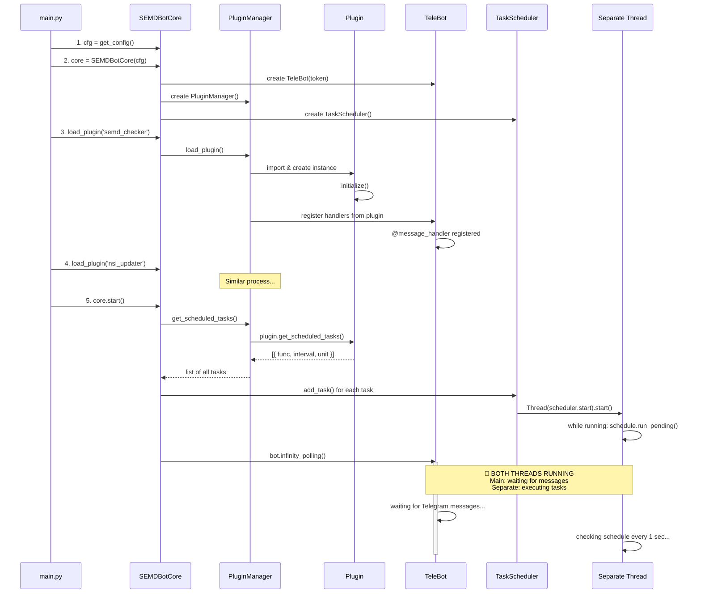
```mermaid
sequenceDiagram
    participant Main as main.py
    participant Core as SEMDBotCore
    participant PM as PluginManager
    participant Plugin as Plugin
    participant Bot as TeleBot
    participant TS as TaskScheduler
    participant Thread as Separate Thread

    Main->>Core: 1. cfg = get_config()
    Main->>Core: 2. core = SEMDBotCore(cfg)
    Core->>Bot: create TeleBot(token)
    Core->>PM: create PluginManager()
    Core->>TS: create TaskScheduler()

    Main->>Core: 3. load_plugin('semd_checker')
    Core->>PM: load_plugin()
    PM->>Plugin: import & create instance
    Plugin->>Plugin: initialize()
    PM->>Bot: register handlers from plugin
    Bot->>Bot: @message_handler registered

    Main->>Core: 4. load_plugin('nsi_updater')
    Note over PM: Similar process...

    Main->>Core: 5. core.start()
    Core->>PM: get_scheduled_tasks()
    PM->>Plugin: plugin.get_scheduled_tasks()
    Plugin-->>PM: [{ func, interval, unit }]
    PM-->>Core: list of all tasks

    Core->>TS: add_task() for each task
    TS->>Thread: Thread(scheduler.start).start()
    Thread->>Thread: while running: schedule.run_pending()

    Core->>Bot: bot.infinity_polling()
    activate Bot
    Note over Bot,Thread: 🔄 BOTH THREADS RUNNING<br/>Main: waiting for messages<br/>Separate: executing tasks

    Bot->>Bot: waiting for Telegram messages...
    Thread->>Thread: checking schedule every 1 sec...

    deactivate Bot
```

---

## 3. Регистрация обработчиков сообщений

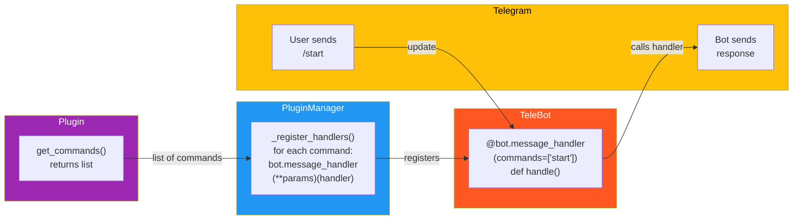
```mermaid
graph LR
    subgraph Plugin["Plugin"]
        GC["get_commands()<br/>returns list"]
    end

    subgraph Manager["PluginManager"]
        RH["_register_handlers()<br/>for each command:<br/>bot.message_handler<br/>(**params)(handler)"]
    end

    subgraph Bot["TeleBot"]
        REG["@bot.message_handler<br/>(commands=['start'])<br/>def handle()"]
    end

    subgraph Telegram["Telegram"]
        MSG["User sends<br/>/start"]
        RESPONSE["Bot sends<br/>response"]
    end

    GC -->|list of commands| RH
    RH -->|registers| REG
    MSG -->|update| REG
    REG -->|calls handler| RESPONSE

    style Plugin fill:#9C27B0,color:#fff
    style Manager fill:#2196F3,color:#fff
    style Bot fill:#FF5722,color:#fff
    style Telegram fill:#FFC107,color:#000
```

---

## 4. Регистрация callback обработчиков

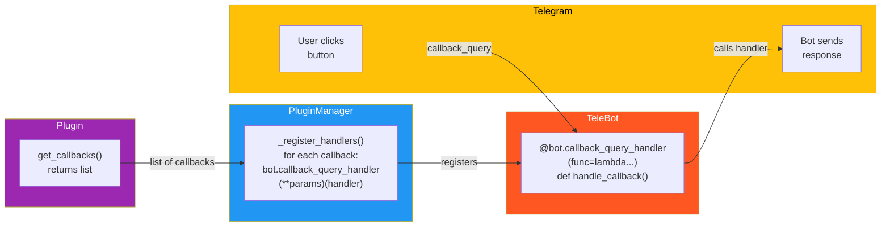
```mermaid
graph LR
    subgraph Plugin["Plugin"]
        GCB["get_callbacks()<br/>returns list"]
    end

    subgraph Manager["PluginManager"]
        RCB["_register_handlers()<br/>for each callback:<br/>bot.callback_query_handler<br/>(**params)(handler)"]
    end

    subgraph Bot["TeleBot"]
        REG2["@bot.callback_query_handler<br/>(func=lambda...)<br/>def handle_callback()"]
    end

    subgraph Telegram["Telegram"]
        BTN["User clicks<br/>button"]
        RESPONSE2["Bot sends<br/>response"]
    end

    GCB -->|list of callbacks| RCB
    RCB -->|registers| REG2
    BTN -->|callback_query| REG2
    REG2 -->|calls handler| RESPONSE2

    style Plugin fill:#9C27B0,color:#fff
    style Manager fill:#2196F3,color:#fff
    style Bot fill:#FF5722,color:#fff
    style Telegram fill:#FFC107,color:#000
```

---

## 5. Система планируемых задач (Scheduled Tasks)

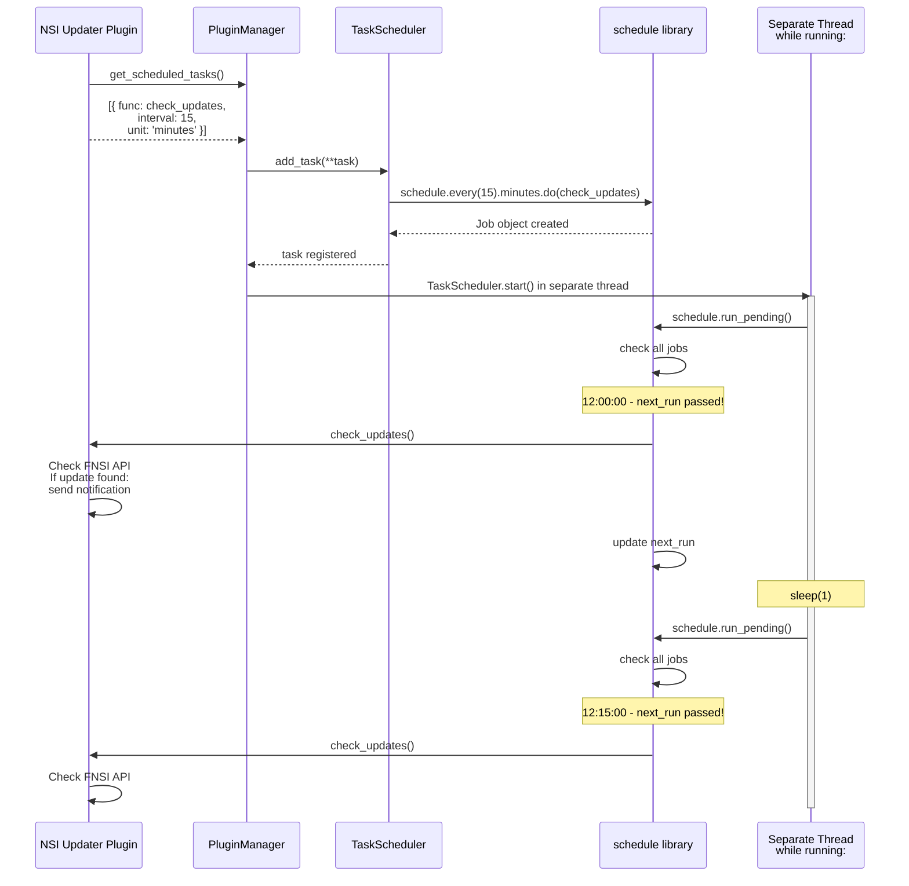
```mermaid
sequenceDiagram
    participant Plugin as NSI Updater Plugin
    participant PM as PluginManager
    participant TS as TaskScheduler
    participant Schedule as schedule library
    participant Thread as Separate Thread<br/>while running:

    Plugin->>PM: get_scheduled_tasks()
    Plugin-->>PM: [{ func: check_updates,<br/>interval: 15,<br/>unit: 'minutes' }]

    PM->>TS: add_task(**task)
    TS->>Schedule: schedule.every(15).minutes.do(check_updates)
    Schedule-->>TS: Job object created

    TS-->>PM: task registered

    PM->>Thread: TaskScheduler.start() in separate thread
    activate Thread

    Thread->>Schedule: schedule.run_pending()
    Schedule->>Schedule: check all jobs
    Note over Schedule: 12:00:00 - next_run passed!
    Schedule->>Plugin: check_updates()
    Plugin->>Plugin: Check FNSI API<br/>If update found:<br/>send notification
    Schedule->>Schedule: update next_run

    Note over Thread: sleep(1)
    Thread->>Schedule: schedule.run_pending()
    Schedule->>Schedule: check all jobs
    Note over Schedule: 12:15:00 - next_run passed!
    Schedule->>Plugin: check_updates()
    Plugin->>Plugin: Check FNSI API

    deactivate Thread
```

---

## 6. Полный поток: пользователь отправляет команду

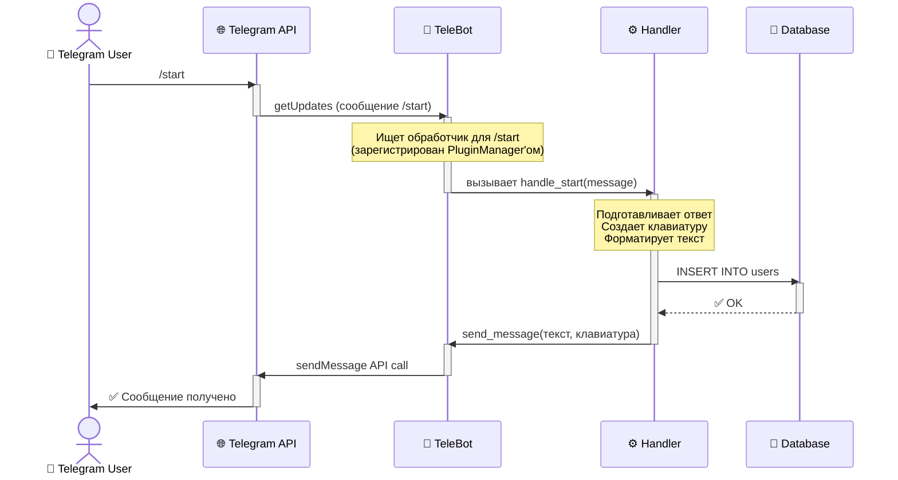
```mermaid
sequenceDiagram
    actor User as 👤 Telegram User
    participant TG as 🌐 Telegram API
    participant Bot as 🤖 TeleBot
    participant Handler as ⚙️ Handler
    participant DB as 💾 Database

    User->>TG: /start
    activate TG

    TG->>Bot: getUpdates (сообщение /start)
    deactivate TG

    activate Bot
    Note over Bot: Ищет обработчик для /start<br/>(зарегистрирован PluginManager'ом)
    Bot->>Handler: вызывает handle_start(message)
    deactivate Bot

    activate Handler
    Note over Handler: Подготавливает ответ<br/>Создает клавиатуру<br/>Форматирует текст

    Handler->>DB: INSERT INTO users
    activate DB
    DB-->>Handler: ✅ OK
    deactivate DB

    Handler->>Bot: send_message(текст, клавиатура)
    deactivate Handler

    activate Bot
    Bot->>TG: sendMessage API call
    deactivate Bot

    activate TG
    TG->>User: ✅ Сообщение получено
    deactivate TG
```

---

## 7. Параллельное выполнение: главный и отдельный потоки

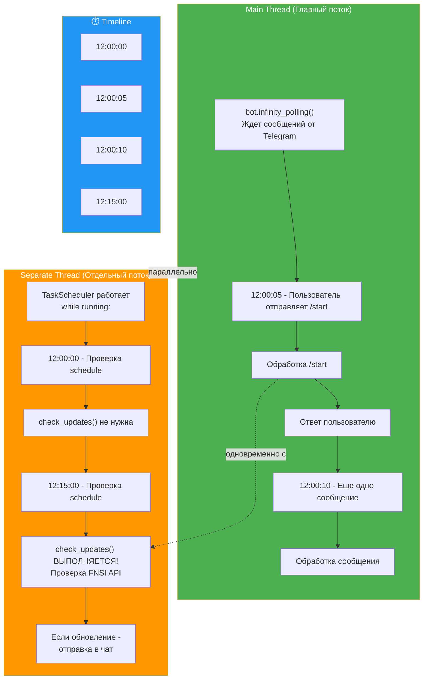
```mermaid
graph TD
    subgraph Main["Main Thread (Главный поток)"]
        A["bot.infinity_polling()<br/>Ждет сообщений от Telegram"]
        B1["12:00:05 - Пользователь отправляет /start"]
        C1["Обработка /start"]
        D1["Ответ пользователю"]
        E1["12:00:10 - Еще одно сообщение"]
        F1["Обработка сообщения"]

        A --> B1 --> C1 --> D1 --> E1 --> F1
    end

    subgraph Separate["Separate Thread (Отдельный поток)"]
        B2["TaskScheduler работает<br/>while running:"]
        C2["12:00:00 - Проверка schedule"]
        D2["check_updates() не нужна"]
        E2["12:15:00 - Проверка schedule"]
        F2["check_updates() ВЫПОЛНЯЕТСЯ!<br/>Проверка FNSI API"]
        G2["Если обновление -<br/>отправка в чат"]

        B2 --> C2 --> D2 --> E2 --> F2 --> G2
    end

    subgraph Timeline["⏱️ Timeline"]
        T1["12:00:00"]
        T2["12:00:05"]
        T3["12:00:10"]
        T4["12:15:00"]
    end

    Main -.->|параллельно| Separate
    C1 -.->|одновременно с| F2

    style Main fill:#4CAF50,color:#fff
    style Separate fill:#FF9800,color:#fff
    style Timeline fill:#2196F3,color:#fff
```

---

## 8. Архитектура в виде слоев

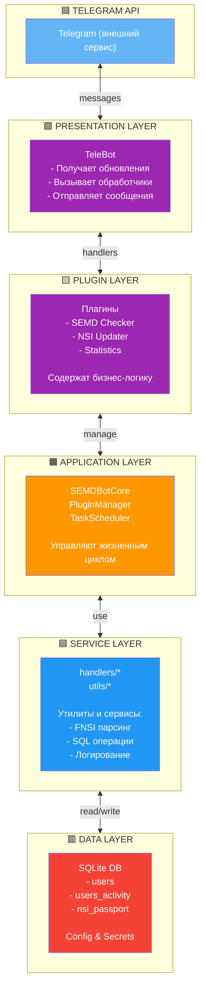
```mermaid
graph TB
    subgraph Telegram["🟦 TELEGRAM API"]
        TG["Telegram (внешний сервис)"]
    end

    subgraph Presentation["🟪 PRESENTATION LAYER"]
        TeleBot["TeleBot<br/>- Получает обновления<br/>- Вызывает обработчики<br/>- Отправляет сообщения"]
    end

    subgraph Plugin["🟨 PLUGIN LAYER"]
        P["Плагины<br/>- SEMD Checker<br/>- NSI Updater<br/>- Statistics<br/><br/>Содержат бизнес-логику"]
    end

    subgraph Application["🟧 APPLICATION LAYER"]
        AC["SEMDBotCore<br/>PluginManager<br/>TaskScheduler<br/><br/>Управляют жизненным циклом"]
    end

    subgraph Service["🟦 SERVICE LAYER"]
        SVC["handlers/*<br/>utils/*<br/><br/>Утилиты и сервисы:<br/>- FNSI парсинг<br/>- SQL операции<br/>- Логирование"]
    end

    subgraph Data["🟥 DATA LAYER"]
        DB["SQLite DB<br/>- users<br/>- users_activity<br/>- nsi_passport<br/><br/>Config & Secrets"]
    end

    TG <-->|messages| Presentation
    Presentation <-->|handlers| Plugin
    Plugin <-->|manage| Application
    Application <-->|use| Service
    Service <-->|read/write| Data

    style TG fill:#64B5F6,color:#fff
    style TeleBot fill:#9C27B0,color:#fff
    style P fill:#9C27B0,color:#fff
    style AC fill:#FF9800,color:#fff
    style SVC fill:#2196F3,color:#fff
    style DB fill:#F44336,color:#fff
```

---

## 9. Жизненный цикл приложения

```mermaid
stateDiagram-v2
    [*] --> Loading: main.py starts
    Loading --> ConfigLoaded: cfg = get_config()
    ConfigLoaded --> CoreCreated: core = SEMDBotCore(cfg)
    CoreCreated --> LoadPlugins1: load_plugin<br/>semd_checker
    LoadPlugins1 --> LoadPlugins2: load_plugin<br/>nsi_updater
    LoadPlugins2 --> LoadPlugins3: load_plugin<br/>statistics
    LoadPlugins3 --> PluginsLoaded: All loaded
    PluginsLoaded --> StartScheduler: core.start()
    StartScheduler --> SchedulerThread: TaskScheduler<br/>in thread
    SchedulerThread --> Running: bot.infinity_polling()

    Running --> Shutdown: Ctrl+C
    Shutdown --> StoppingScheduler: scheduler.stop()
    StoppingScheduler --> StoppingBot: bot.stop_polling()
    StoppingBot --> ClosingPlugins: shutdown_all()
    ClosingPlugins --> [*]: EXIT

    style Loading fill:#FFC107,color:#000
    style ConfigLoaded fill:#FFC107,color:#000
    style CoreCreated fill:#2196F3,color:#fff
    style LoadPlugins1 fill:#2196F3,color:#fff
    style LoadPlugins2 fill:#2196F3,color:#fff
    style LoadPlugins3 fill:#2196F3,color:#fff
    style PluginsLoaded fill:#4CAF50,color:#fff
    style StartScheduler fill:#FF9800,color:#fff
    style SchedulerThread fill:#FF9800,color:#fff
    style Running fill:#4CAF50,color:#fff
    style Shutdown fill:#F44336,color:#fff
    style StoppingScheduler fill:#F44336,color:#fff
    style StoppingBot fill:#F44336,color:#fff
    style ClosingPlugins fill:#F44336,color:#fff
```

**Параллельное выполнение в Running state:**
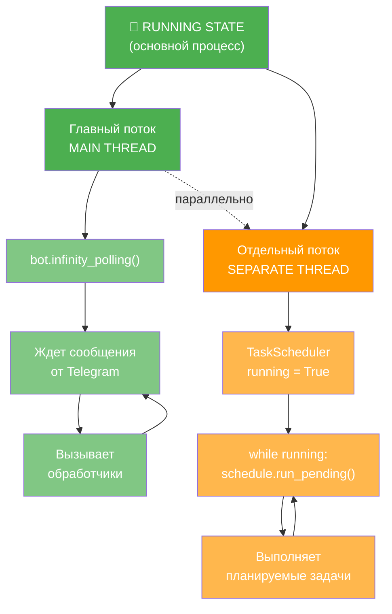
```mermaid
graph TD
    A["🔄 RUNNING STATE<br/>(основной процесс)"]

    A --> B["Главный поток<br/>MAIN THREAD"]
    A --> C["Отдельный поток<br/>SEPARATE THREAD"]

    B --> B1["bot.infinity_polling()"]
    B1 --> B2["Ждет сообщения<br/>от Telegram"]
    B2 --> B3["Вызывает<br/>обработчики"]
    B3 --> B2

    C --> C1["TaskScheduler<br/>running = True"]
    C1 --> C2["while running:<br/>  schedule.run_pending()"]
    C2 --> C3["Выполняет<br/>планируемые задачи"]
    C3 --> C2

    B -.->|параллельно| C

    style A fill:#4CAF50,color:#fff
    style B fill:#4CAF50,color:#fff
    style B1 fill:#81C784,color:#fff
    style B2 fill:#81C784,color:#fff
    style B3 fill:#81C784,color:#fff
    style C fill:#FF9800,color:#fff
    style C1 fill:#FFB74D,color:#fff
    style C2 fill:#FFB74D,color:#fff
    style C3 fill:#FFB74D,color:#fff
```

---

## 10. Иерархия классов и наследование

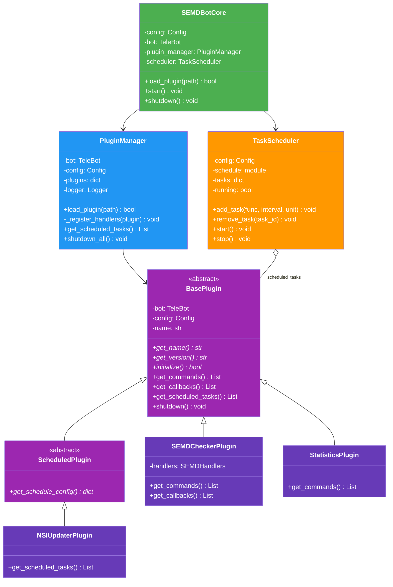
```mermaid
classDiagram
    class BasePlugin {
        <<abstract>>
        -bot: TeleBot
        -config: Config
        -name: str
        +get_name()* str
        +get_version()* str
        +initialize()* bool
        +get_commands() List
        +get_callbacks() List
        +get_scheduled_tasks() List
        +shutdown() void
    }

    class ScheduledPlugin {
        <<abstract>>
        +get_schedule_config()* dict
    }

    class SEMDCheckerPlugin {
        -handlers: SEMDHandlers
        +get_commands() List
        +get_callbacks() List
    }

    class NSIUpdaterPlugin {
        +get_scheduled_tasks() List
    }

    class StatisticsPlugin {
        +get_commands() List
    }

    class PluginManager {
        -bot: TeleBot
        -config: Config
        -plugins: dict
        -logger: Logger
        +load_plugin(path) bool
        -_register_handlers(plugin) void
        +get_scheduled_tasks() List
        +shutdown_all() void
    }

    class SEMDBotCore {
        -config: Config
        -bot: TeleBot
        -plugin_manager: PluginManager
        -scheduler: TaskScheduler
        +load_plugin(path) bool
        +start() void
        +shutdown() void
    }

    class TaskScheduler {
        -config: Config
        -schedule: module
        -tasks: dict
        -running: bool
        +add_task(func, interval, unit) void
        +remove_task(task_id) void
        +start() void
        +stop() void
    }

    BasePlugin <|-- ScheduledPlugin
    BasePlugin <|-- SEMDCheckerPlugin
    ScheduledPlugin <|-- NSIUpdaterPlugin
    BasePlugin <|-- StatisticsPlugin

    SEMDBotCore --> PluginManager
    SEMDBotCore --> TaskScheduler
    PluginManager --> BasePlugin
    TaskScheduler o-- "scheduled_tasks" BasePlugin

    style BasePlugin fill:#9C27B0,color:#fff
    style ScheduledPlugin fill:#9C27B0,color:#fff
    style SEMDCheckerPlugin fill:#673AB7,color:#fff
    style NSIUpdaterPlugin fill:#673AB7,color:#fff
    style StatisticsPlugin fill:#673AB7,color:#fff
    style PluginManager fill:#2196F3,color:#fff
    style SEMDBotCore fill:#4CAF50,color:#fff
    style TaskScheduler fill:#FF9800,color:#fff
```

---

## 11. Взаимодействие плагинов с данными

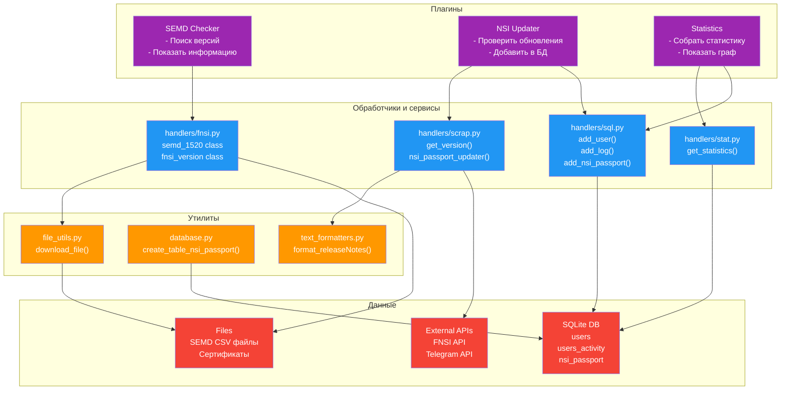
```mermaid
graph TB
    subgraph Plugins["Плагины"]
        P1["SEMD Checker<br/>- Поиск версий<br/>- Показать информацию"]
        P2["NSI Updater<br/>- Проверить обновления<br/>- Добавить в БД"]
        P3["Statistics<br/>- Собрать статистику<br/>- Показать граф"]
    end

    subgraph Handlers["Обработчики и сервисы"]
        H1["handlers/fnsi.py<br/>semd_1520 class<br/>fnsi_version class"]
        H2["handlers/scrap.py<br/>get_version()<br/>nsi_passport_updater()"]
        H3["handlers/sql.py<br/>add_user()<br/>add_log()<br/>add_nsi_passport()"]
        H4["handlers/stat.py<br/>get_statistics()"]
    end

    subgraph Utils["Утилиты"]
        U1["text_formatters.py<br/>format_releaseNotes()"]
        U2["database.py<br/>create_table_nsi_passport()"]
        U3["file_utils.py<br/>download_file()"]
    end

    subgraph Data["Данные"]
        D1["SQLite DB<br/>users<br/>users_activity<br/>nsi_passport"]
        D2["Files<br/>SEMD CSV файлы<br/>Сертификаты"]
        D3["External APIs<br/>FNSI API<br/>Telegram API"]
    end

    P1 --> H1
    P2 --> H2
    P2 --> H3
    P3 --> H4
    P3 --> H3

    H1 --> U3
    H2 --> U1
    H3 --> D1
    H4 --> D1

    U2 --> D1
    U3 --> D2
    H2 --> D3
    H1 --> D2

    style P1 fill:#9C27B0,color:#fff
    style P2 fill:#9C27B0,color:#fff
    style P3 fill:#9C27B0,color:#fff
    style H1 fill:#2196F3,color:#fff
    style H2 fill:#2196F3,color:#fff
    style H3 fill:#2196F3,color:#fff
    style H4 fill:#2196F3,color:#fff
    style U1 fill:#FF9800,color:#fff
    style U2 fill:#FF9800,color:#fff
    style U3 fill:#FF9800,color:#fff
    style D1 fill:#F44336,color:#fff
    style D2 fill:#F44336,color:#fff
    style D3 fill:#F44336,color:#fff
```

---

## 12. Диаграмма состояний плагина

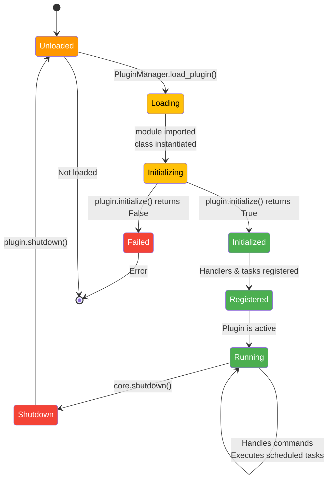
```mermaid
stateDiagram-v2
    [*] --> Unloaded

    Unloaded --> Loading: PluginManager.load_plugin()

    Loading --> Initializing: module imported<br/>class instantiated

    Initializing --> Initialized: plugin.initialize() returns True
    Initializing --> Failed: plugin.initialize() returns False

    Initialized --> Registered: Handlers & tasks registered

    Registered --> Running: Plugin is active

    Running --> Running: Handles commands<br/>Executes scheduled tasks

    Running --> Shutdown: core.shutdown()

    Shutdown --> Unloaded: plugin.shutdown()

    Failed --> [*]: Error
    Unloaded --> [*]: Not loaded

    style Unloaded fill:#FF9800,color:#fff
    style Loading fill:#FFC107,color:#000
    style Initializing fill:#FFC107,color:#000
    style Initialized fill:#4CAF50,color:#fff
    style Registered fill:#4CAF50,color:#fff
    style Running fill:#4CAF50,color:#fff
    style Shutdown fill:#F44336,color:#fff
    style Failed fill:#F44336,color:#fff
```

---

## 13. Процесс обработки сообщения с callbacks

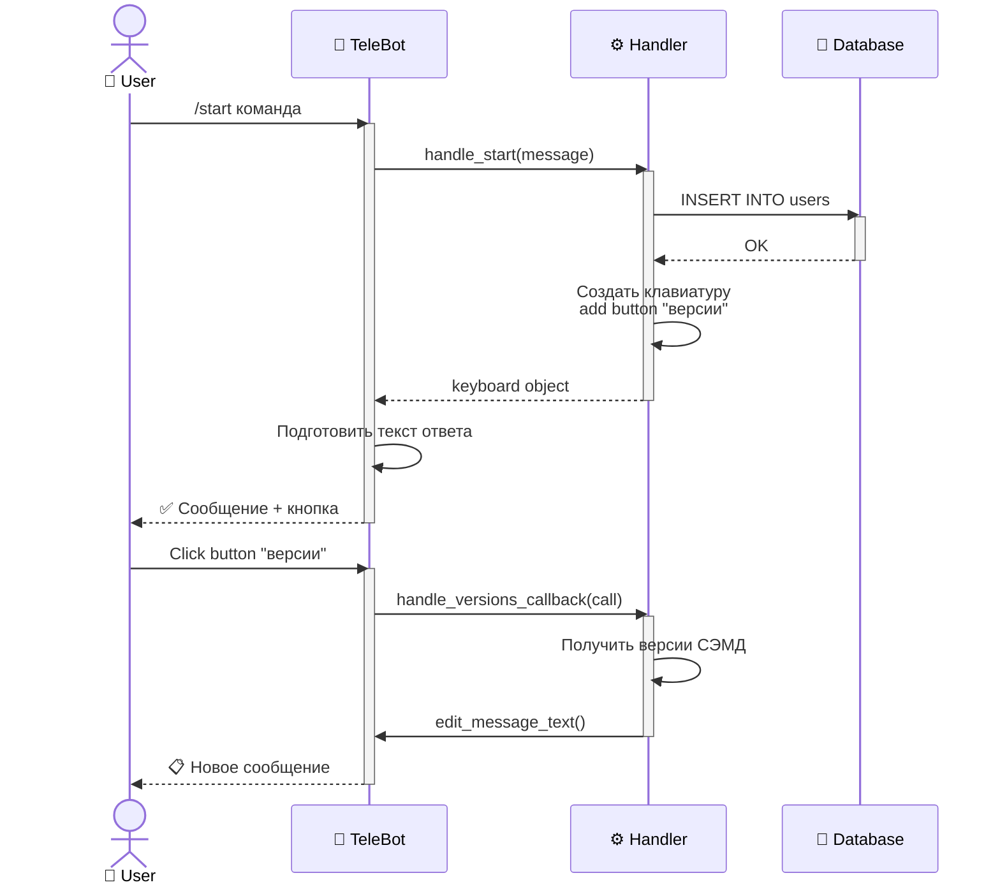
```mermaid
sequenceDiagram
    actor User as 👤 User
    participant Bot as 🤖 TeleBot
    participant Handler as ⚙️ Handler
    participant DB as 💾 Database

    User->>Bot: /start команда
    activate Bot
    Bot->>Handler: handle_start(message)
    activate Handler

    Handler->>DB: INSERT INTO users
    activate DB
    DB-->>Handler: OK
    deactivate DB

    Handler->>Handler: Создать клавиатуру<br/>add button "версии"
    Handler-->>Bot: keyboard object
    deactivate Handler

    Bot->>Bot: Подготовить текст ответа
    Bot-->>User: ✅ Сообщение + кнопка
    deactivate Bot

    User->>Bot: Click button "версии"
    activate Bot
    Bot->>Handler: handle_versions_callback(call)
    activate Handler

    Handler->>Handler: Получить версии СЭМД
    Handler->>Bot: edit_message_text()
    deactivate Handler

    Bot-->>User: 📋 Новое сообщение
    deactivate Bot
```

---

## 14. Диаграмма потоков выполнения

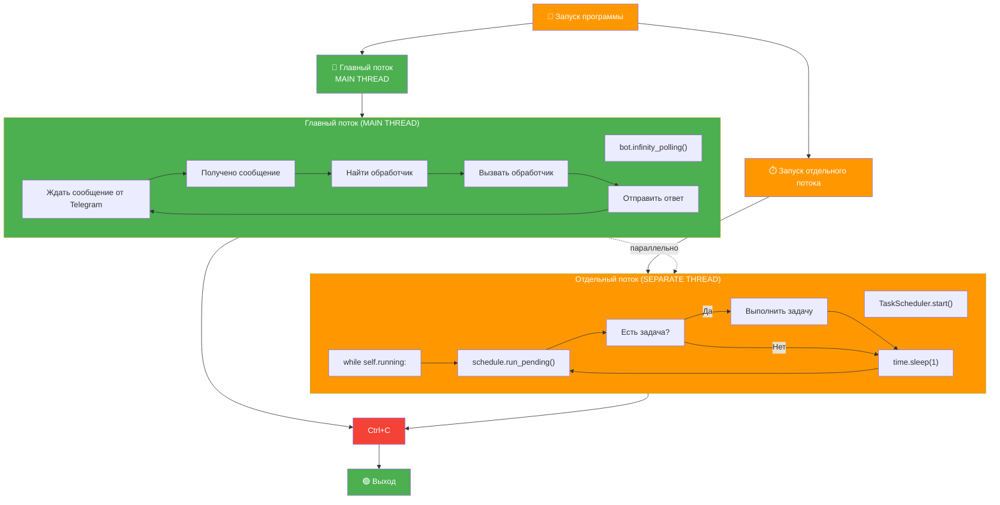
```mermaid
graph TD
    Start["🔴 Запуск программы"]

    Start --> Main["👤 Главный поток<br/>MAIN THREAD"]
    Start --> Sep["⏱️ Запуск отдельного потока"]

    subgraph MainThread["Главный поток (MAIN THREAD)"]
        M1["bot.infinity_polling()"]
        M2["Ждать сообщение от Telegram"]
        M3["Получено сообщение"]
        M4["Найти обработчик"]
        M5["Вызвать обработчик"]
        M6["Отправить ответ"]
        M2 --> M3 --> M4 --> M5 --> M6 --> M2
    end

    subgraph SeparateThread["Отдельный поток (SEPARATE THREAD)"]
        S1["TaskScheduler.start()"]
        S2["while self.running:"]
        S3["schedule.run_pending()"]
        S4["Есть задача?"]
        S5["Выполнить задачу"]
        S6["time.sleep(1)"]
        S2 --> S3 --> S4
        S4 -->|Да| S5 --> S6 --> S3
        S4 -->|Нет| S6
    end

    Main --> MainThread
    Sep --> SeparateThread

    MainThread -.->|параллельно| SeparateThread

    MainThread --> Shutdown["Ctrl+C"]
    SeparateThread --> Shutdown
    Shutdown --> Exit["🟢 Выход"]

    style Start fill:#FF9800,color:#fff
    style Main fill:#4CAF50,color:#fff
    style Sep fill:#FF9800,color:#fff
    style MainThread fill:#4CAF50,color:#fff
    style SeparateThread fill:#FF9800,color:#fff
    style Shutdown fill:#F44336,color:#fff
    style Exit fill:#4CAF50,color:#fff
```

---

## 15. Полная система взаимодействия

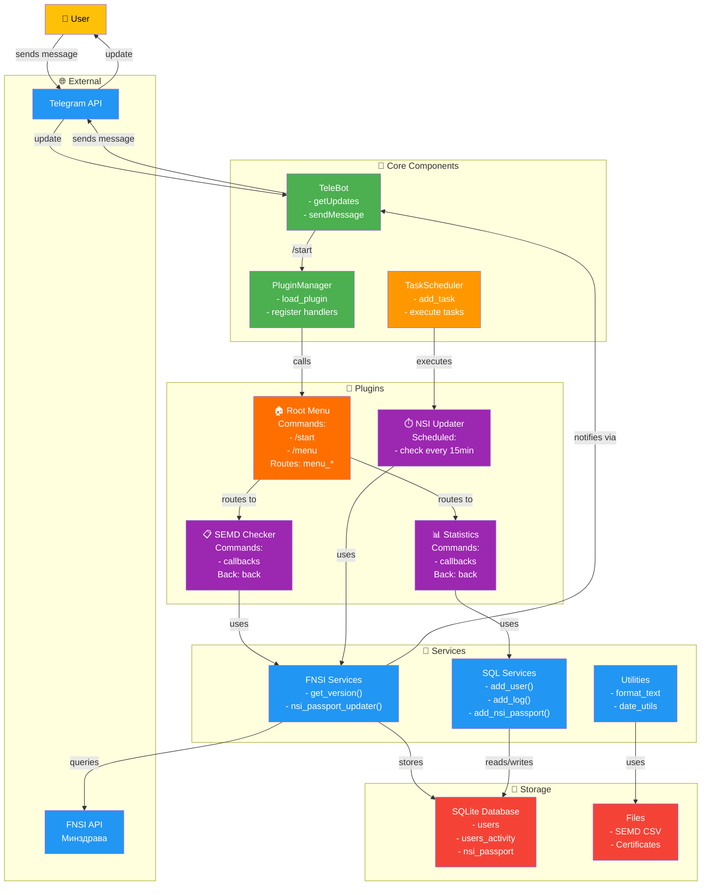
```mermaid
graph TB
    User["👤 User"]

    subgraph External["🌐 External"]
        TG["Telegram API"]
        FNSI["FNSI API<br/>Минздрава"]
    end

    subgraph Core["🔷 Core Components"]
        Bot["TeleBot<br/>- getUpdates<br/>- sendMessage"]
        PM["PluginManager<br/>- load_plugin<br/>- register handlers"]
        TS["TaskScheduler<br/>- add_task<br/>- execute tasks"]
    end

    subgraph Plugins["🔹 Plugins"]
        P0["🏠 Root Menu<br/>Commands:<br/>- /start<br/>- /menu<br/>Routes: menu_*"]
        P1["📋 SEMD Checker<br/>Commands:<br/>- callbacks<br/>Back: back"]
        P2["⏱️ NSI Updater<br/>Scheduled:<br/>- check every 15min"]
        P3["📊 Statistics<br/>Commands:<br/>- callbacks<br/>Back: back"]
    end

    subgraph Services["🔶 Services"]
        FNSI_S["FNSI Services<br/>- get_version()<br/>- nsi_passport_updater()"]
        SQL_S["SQL Services<br/>- add_user()<br/>- add_log()<br/>- add_nsi_passport()"]
        UTIL_S["Utilities<br/>- format_text<br/>- date_utils"]
    end

    subgraph Storage["💾 Storage"]
        DB["SQLite Database<br/>- users<br/>- users_activity<br/>- nsi_passport"]
        Files["Files<br/>- SEMD CSV<br/>- Certificates"]
    end

    User -->|sends message| TG
    TG -->|update| Bot
    Bot -->|/start| PM
    PM -->|calls| P0
    P0 -->|routes to| P1
    P0 -->|routes to| P3
    P1 -->|uses| FNSI_S
    P3 -->|uses| SQL_S
    FNSI_S -->|queries| FNSI
    FNSI_S -->|stores| DB
    SQL_S -->|reads/writes| DB
    UTIL_S -->|uses| Files

    TS -->|executes| P2
    P2 -->|uses| FNSI_S
    FNSI_S -->|notifies via| Bot
    Bot -->|sends message| TG
    TG -->|update| User

    style User fill:#FFC107,color:#000
    style TG fill:#2196F3,color:#fff
    style FNSI fill:#2196F3,color:#fff
    style Bot fill:#4CAF50,color:#fff
    style PM fill:#4CAF50,color:#fff
    style TS fill:#FF9800,color:#fff
    style P0 fill:#FF6F00,color:#fff
    style P1 fill:#9C27B0,color:#fff
    style P2 fill:#9C27B0,color:#fff
    style P3 fill:#9C27B0,color:#fff
    style FNSI_S fill:#2196F3,color:#fff
    style SQL_S fill:#2196F3,color:#fff
    style UTIL_S fill:#2196F3,color:#fff
    style DB fill:#F44336,color:#fff
    style Files fill:#F44336,color:#fff
```

---

## 16. Архитектура с Root Menu Plugin

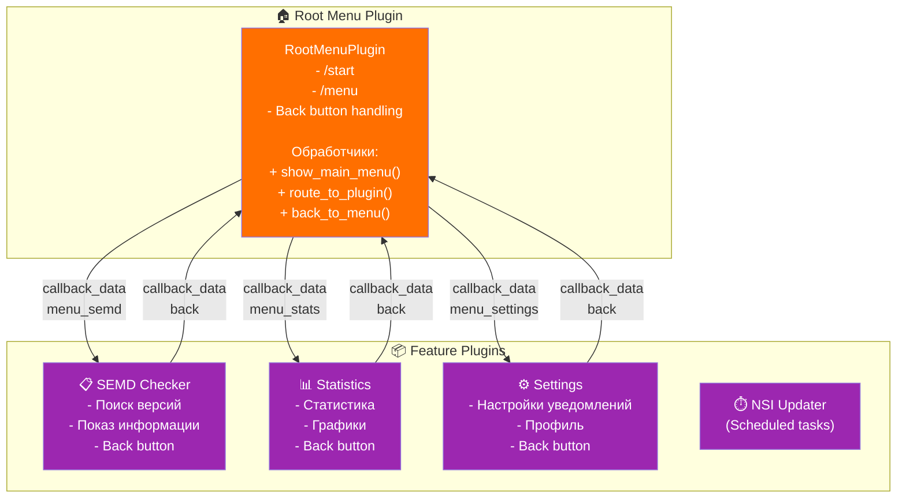
```mermaid
graph TB
    subgraph Menu["🏠 Root Menu Plugin"]
        RM["RootMenuPlugin<br/>- /start<br/>- /menu<br/>- Back button handling<br/><br/>Обработчики:<br/>+ show_main_menu()<br/>+ route_to_plugin()<br/>+ back_to_menu()"]
    end

    subgraph Plugins["📦 Feature Plugins"]
        P1["📋 SEMD Checker<br/>- Поиск версий<br/>- Показ информации<br/>- Back button"]
        P2["📊 Statistics<br/>- Статистика<br/>- Графики<br/>- Back button"]
        P3["⚙️ Settings<br/>- Настройки уведомлений<br/>- Профиль<br/>- Back button"]
        P4["⏱️ NSI Updater<br/>(Scheduled tasks)"]
    end

    RM -->|"callback_data<br/>menu_semd"| P1
    RM -->|"callback_data<br/>menu_stats"| P2
    RM -->|"callback_data<br/>menu_settings"| P3

    P1 -->|"callback_data<br/>back"| RM
    P2 -->|"callback_data<br/>back"| RM
    P3 -->|"callback_data<br/>back"| RM

    style RM fill:#FF6F00,color:#fff
    style P1 fill:#9C27B0,color:#fff
    style P2 fill:#9C27B0,color:#fff
    style P3 fill:#9C27B0,color:#fff
    style P4 fill:#9C27B0,color:#fff
```

---

## 17. User Interface Flow с Root Menu

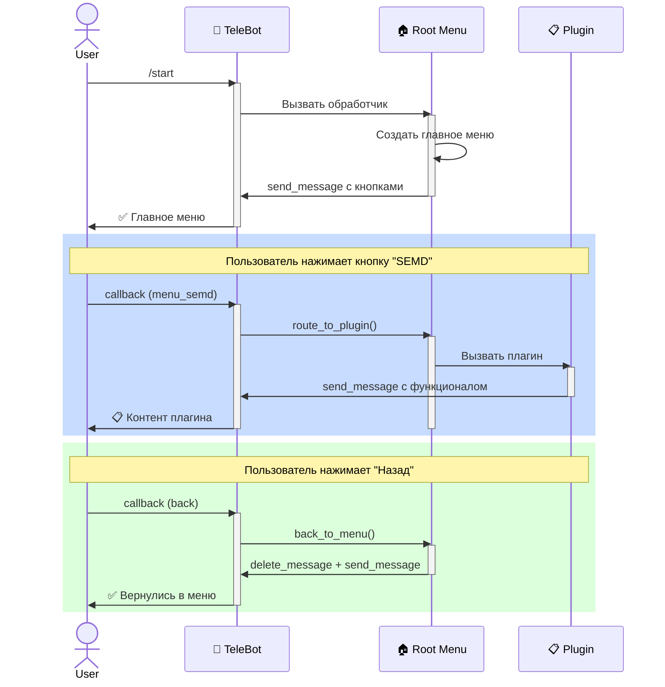
```mermaid
sequenceDiagram
    actor User
    participant Bot as 🤖 TeleBot
    participant Menu as 🏠 Root Menu
    participant Plugin as 📋 Plugin

    User->>Bot: /start
    activate Bot

    Bot->>Menu: Вызвать обработчик
    activate Menu

    Menu->>Menu: Создать главное меню
    Menu->>Bot: send_message с кнопками
    deactivate Menu

    Bot->>User: ✅ Главное меню
    deactivate Bot

    rect rgb(200, 220, 255)
        note over User,Plugin: Пользователь нажимает кнопку "SEMD"
        User->>Bot: callback (menu_semd)
        activate Bot
        Bot->>Menu: route_to_plugin()
        activate Menu
        Menu->>Plugin: Вызвать плагин
        activate Plugin
        Plugin->>Bot: send_message с функционалом
        deactivate Plugin
        Bot->>User: 📋 Контент плагина
        deactivate Menu
        deactivate Bot
    end

    rect rgb(220, 255, 220)
        note over User,Plugin: Пользователь нажимает "Назад"
        User->>Bot: callback (back)
        activate Bot
        Bot->>Menu: back_to_menu()
        activate Menu
        Menu->>Bot: delete_message + send_message
        deactivate Menu
        Bot->>User: ✅ Вернулись в меню
        deactivate Bot
    end
```

---

## 18. Структура загрузки плагинов (с учетом Root Menu)

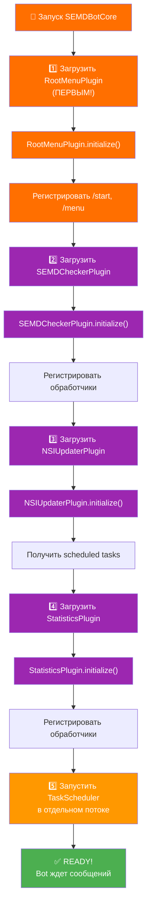
```mermaid
graph TD
    Start["🔴 Запуск SEMDBotCore"]

    Start --> Load1["1️⃣ Загрузить RootMenuPlugin<br/>(ПЕРВЫМ!)"]
    Load1 --> Init1["RootMenuPlugin.initialize()"]
    Init1 --> Reg1["Регистрировать /start, /menu"]

    Reg1 --> Load2["2️⃣ Загрузить SEMDCheckerPlugin"]
    Load2 --> Init2["SEMDCheckerPlugin.initialize()"]
    Init2 --> Reg2["Регистрировать обработчики"]

    Reg2 --> Load3["3️⃣ Загрузить NSIUpdaterPlugin"]
    Load3 --> Init3["NSIUpdaterPlugin.initialize()"]
    Init3 --> Tasks["Получить scheduled tasks"]

    Tasks --> Load4["4️⃣ Загрузить StatisticsPlugin"]
    Load4 --> Init4["StatisticsPlugin.initialize()"]
    Init4 --> Reg4["Регистрировать обработчики"]

    Reg4 --> Start_Scheduler["5️⃣ Запустить TaskScheduler<br/>в отдельном потоке"]
    Start_Scheduler --> Running["✅ READY!<br/>Bot ждет сообщений"]

    style Start fill:#FF6F00,color:#fff
    style Load1 fill:#FF6F00,color:#fff
    style Init1 fill:#FF6F00,color:#fff
    style Reg1 fill:#FF6F00,color:#fff
    style Load2 fill:#9C27B0,color:#fff
    style Load3 fill:#9C27B0,color:#fff
    style Load4 fill:#9C27B0,color:#fff
    style Init2 fill:#9C27B0,color:#fff
    style Init3 fill:#9C27B0,color:#fff
    style Init4 fill:#9C27B0,color:#fff
    style Start_Scheduler fill:#FF9800,color:#fff
    style Running fill:#4CAF50,color:#fff
```

---

## 19. Обработка callback'ов с Root Menu

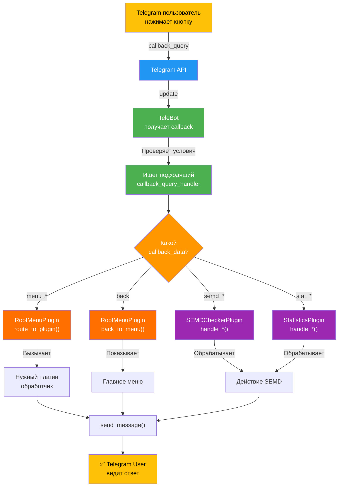
```mermaid
graph TB
    Callback["Telegram пользователь<br/>нажимает кнопку"]

    Callback -->|callback_query| TG["Telegram API"]
    TG -->|update| Bot["TeleBot<br/>получает callback"]

    Bot -->|Проверяет условия| Find["Ищет подходящий<br/>callback_query_handler"]

    Find --> Decision{Какой<br/>callback_data?}

    Decision -->|"menu_*"| MenuHandler["RootMenuPlugin<br/>route_to_plugin()"]
    Decision -->|"back"| BackHandler["RootMenuPlugin<br/>back_to_menu()"]
    Decision -->|"semd_*"| SEMDHandler["SEMDCheckerPlugin<br/>handle_*()"]
    Decision -->|"stat_*"| StatHandler["StatisticsPlugin<br/>handle_*()"]

    MenuHandler -->|Вызывает| Plugin["Нужный плагин<br/>обработчик"]
    BackHandler -->|Показывает| Menu["Главное меню"]
    SEMDHandler -->|Обрабатывает| Action["Действие SEMD"]
    StatHandler -->|Обрабатывает| Action

    Plugin --> Send["send_message()"]
    Menu --> Send
    Action --> Send

    Send --> User["✅ Telegram User<br/>видит ответ"]

    style Callback fill:#FFC107,color:#000
    style TG fill:#2196F3,color:#fff
    style Bot fill:#4CAF50,color:#fff
    style Find fill:#4CAF50,color:#fff
    style Decision fill:#FF9800,color:#fff
    style MenuHandler fill:#FF6F00,color:#fff
    style BackHandler fill:#FF6F00,color:#fff
    style SEMDHandler fill:#9C27B0,color:#fff
    style StatHandler fill:#9C27B0,color:#fff
    style User fill:#FFC107,color:#000
```

